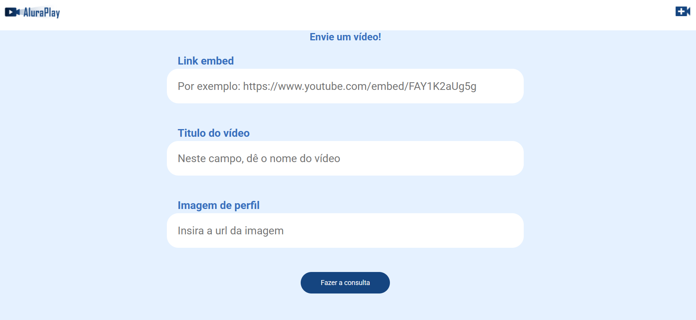

## ▶️ Alura Play

O **Alura Play** é uma **plataforma de vídeos** inspirada em um player de cursos da Alura. O projeto foi construído com foco em **requisições assíncronas** utilizando **JavaScript moderno**, onde é possível visualizar vídeos carregados de uma **API mockada**, pesquisar conteúdos e adicionar novos vídeos dinamicamente por meio de requisições POST.

 

## 🚀 Sobre o Projeto

Este projeto foi desenvolvido durante o curso da Alura:

* "JavaScript: criando requisições"

O objetivo é transformar uma página estática em uma aplicação dinâmica, consumindo dados de uma **API JSON-Server**. Nele, foram implementadas requisições GET e POST, além do tratamento de erros e boas práticas de **JavaScript assíncrono**, com async/await e try/catch.

## 📚 Objetivos do Curso

* Saber como **mockar uma API**;
* Realizar requisições **GET** para retornar dados de uma API;
* Construir requisições **POST** para cadastrar dados em uma API;
* Reforçar seus conhecimentos em **JavaScript assíncrono**;
* **Tratar possíveis erros** de requisição retornados da API;
* Aprender a transformar uma **página estática em dinâmica**.

## 🛠️ Tecnologias Utilizadas

## 🖼️ Visualização do Projeto

Uma prévia das principais funcionalidades do **Alura Play**:

**🏠 Tela Inicial**

A galeria de vídeos é carregada dinamicamente via API. No topo, há um header com a logo da Alura, barra de pesquisa e botão para adicionar vídeos.

**➕ Adicionar Vídeo**

Formulário que permite adicionar novos vídeos, enviando os dados com uma requisição POST.

